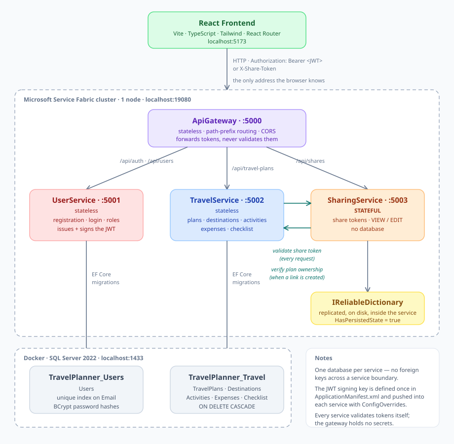
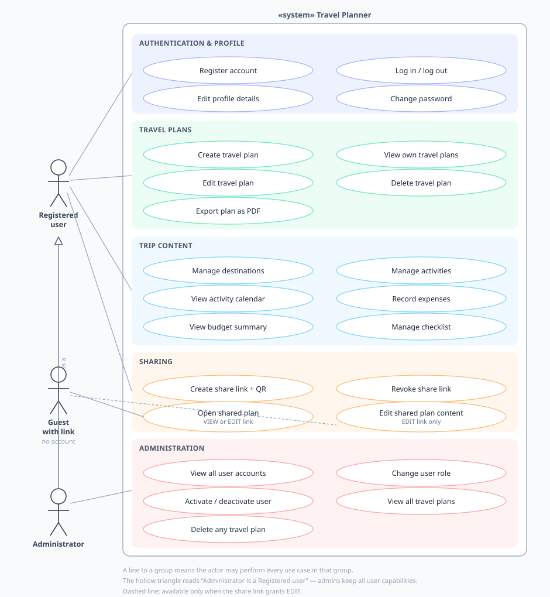

# Travel Planner

Web application for planning trips: travel plans, destinations, day-by-day activities with a
calendar view, expenses against a budget, packing checklists, PDF export, and sharing a plan with
people who have no account — by link or QR code, read-only or editable.

Course project — *Primena veb programiranja u infrastrukturnim sistemima*.

**Frontend:** React 19 · TypeScript · Vite · Tailwind CSS v4
**Backend:** Microsoft Service Fabric · ASP.NET Core 3.1 · Entity Framework Core 3.1
**Database:** Microsoft SQL Server 2022 (Docker)

---

## Architecture



Four services run on a Service Fabric cluster:

| Service | Port | Kind | Responsibility |
|---|---|---|---|
| **ApiGateway** | 5000 | stateless | Single entry point for the frontend. Routes by path prefix, handles CORS, forwards tokens. Holds no secrets and validates nothing. |
| **UserService** | 5001 | stateless | Registration, login, roles, user administration. Issues and signs the JWT. |
| **TravelService** | 5002 | stateless | Travel plans, destinations, activities, expenses, checklist. Owns all trip data. |
| **SharingService** | 5003 | **stateful** | Share tokens in an `IReliableDictionary` — replicated and written to disk by the cluster. No database. |

Each service owns its own data. There are **no foreign keys across service boundaries**:
`TravelPlans.UserId` is a plain integer referencing a user that lives in another service's database.

Two internal calls exist, both narrow and one-way per direction:

- `SharingService → TravelService` — *"does this user own plan N?"*, when a share link is created.
- `TravelService → SharingService` — *"is this share token valid, and what does it allow?"*, on
  **every request** that carries one.

The browser only ever talks to the gateway.

### Use cases



---

## Prerequisites

The project targets the toolchain used in the course; nothing newer is required.

- Windows 10/11
- **Visual Studio 2019** (16.11) with the *Azure Development* workload and Service Fabric tools
- **Microsoft Service Fabric SDK** and a local development cluster
- **.NET Core 3.1 SDK**
- **Docker Desktop** (for SQL Server)
- **Node.js 20+** and npm
- Optional: SQL Server Management Studio, to inspect the databases

---

## Running the system

### 1. SQL Server

The databases run in a Docker container. Create it once:

```bash
docker run -d --name sql-travelplanner --restart unless-stopped -e "ACCEPT_EULA=Y" -e "MSSQL_SA_PASSWORD=SuperStrongPassword123!" -p 1433:1433 -v sql-travelplanner-data:/var/opt/mssql mcr.microsoft.com/mssql/server:2022-latest
```

The named volume keeps the data if the container is recreated. On later sessions it starts with
Docker Desktop automatically (`--restart unless-stopped`).

**You do not need to create the databases.** Each service calls `Database.Migrate()` on startup, so
`TravelPlanner_Users` and `TravelPlanner_Travel` are created and migrated on first run.

> If you use a different SA password, update the `ConnectionString` parameter in
> `backend/TravelPlanner/UserService/PackageRoot/Config/Settings.xml` and the matching file in
> `TravelService`.

### 2. Service Fabric cluster

Start the local cluster from the **Service Fabric Local Cluster Manager** tray icon →
**Start Local Cluster**. If no cluster exists yet, use **Setup Local Cluster → Windows 1 Node**.

The application is written for a **one-node** cluster: services bind fixed ports, and
`StartupServiceParameters/Local.1Node.xml` sets the stateful service to a single replica.

Confirm the cluster is up at <http://localhost:19080/Explorer> before deploying.

### 3. Backend

Open `backend/TravelPlanner/TravelPlanner.sln` in Visual Studio 2019 and press **Ctrl+F5**.

First deployment takes a few minutes: it builds four services, packages them, registers the
application type and creates the service instances. When it finishes, Service Fabric Explorer shows
`fabric:/TravelPlanner` with four services in state **Ok**, and a browser tab opens on
<http://localhost:5000/>, which returns a small health JSON from the gateway.

Swagger is available per service:

- <http://localhost:5001/swagger> — UserService (log in here to obtain a token)
- <http://localhost:5002/swagger> — TravelService
- <http://localhost:5003/swagger> — SharingService

To call a protected endpoint from Swagger: log in on 5001, copy the `token` value from the response,
click **Authorize** on any of the three pages and paste it. A token issued by `UserService` is
accepted by the others because all services share one signing key.

### 4. Frontend

```bash
cd frontend
npm install
npm run dev
```

Open <http://localhost:5173>.

The port matters: the gateway's CORS policy allows exactly that origin
(`Cors:AllowedOrigins` in `backend/TravelPlanner/ApiGateway/appsettings.json`).

### 5. Sign in

A default administrator is seeded on first startup:

```
admin@travelplanner.com
Admin#2026!
```

Or register a new account — new accounts always get the `User` role.

---

## Configuration

| What | Where |
|---|---|
| Backend URL used by the frontend | `frontend/.env` → `VITE_API_BASE_URL` |
| Service URLs and allowed CORS origin | `backend/TravelPlanner/ApiGateway/appsettings.json` |
| Connection strings, JWT key, admin credentials | each service's `PackageRoot/Config/Settings.xml` |
| JWT key shared by all services | `backend/TravelPlanner/TravelPlanner/ApplicationPackageRoot/ApplicationManifest.xml` |
| Token issuer, audience, lifetime | each service's `appsettings.json` |

Secrets live in the Service Fabric **configuration package**, not in `appsettings.json`. They are
read at runtime through `CodePackageActivationContext` and merged into `IConfiguration`. The JWT
signing key is declared **once** as an application parameter and pushed into each service with
`ConfigOverrides`, so there is a single place to change it.

For a real deployment those values would come from `ApplicationParameters/Cloud.xml` at deploy time,
or from Service Fabric encrypted parameters. The values committed here are local development values.

---

## Database migrations

Schema changes are Entity Framework Core migrations, committed under each service's `Migrations`
folder. To add one, use the Package Manager Console in Visual Studio:

```
Add-Migration <Name> -Project TravelService -StartupProject TravelService
Update-Database -Project TravelService -StartupProject TravelService
```

`-StartupProject` is required because the solution's startup project is the Service Fabric
application, which EF tooling cannot use. Each service has an `IDesignTimeDbContextFactory` that
reads the connection string from its `Settings.xml`, so design-time and runtime always target the
same database.

---

## API

All requests go through the gateway on port 5000.

| Method | Route | Access |
|---|---|---|
| POST | `/api/auth/register` | public |
| POST | `/api/auth/login` | public |
| GET · PUT | `/api/users/me` | authenticated |
| PUT | `/api/users/me/password` | authenticated |
| GET | `/api/users` | admin |
| PUT | `/api/users/{id}/role` · `/api/users/{id}/status` | admin |
| GET · POST | `/api/travel-plans` | authenticated |
| GET | `/api/travel-plans/all` | admin |
| GET · PUT · DELETE | `/api/travel-plans/{id}` | owner, admin, or share token |
| GET · POST · PUT · DELETE | `/api/travel-plans/{planId}/destinations[/{id}]` | owner, admin, or EDIT share token |
| GET · POST · PUT · DELETE | `/api/travel-plans/{planId}/activities[/{id}]` | ″ |
| GET · POST · PUT · DELETE | `/api/travel-plans/{planId}/expenses[/{id}]` | ″ |
| GET · POST · PUT · DELETE | `/api/travel-plans/{planId}/checklist[/{id}]` | ″ |
| POST | `/api/shares` | authenticated, plan owner |
| GET | `/api/shares/plans/{planId}` | authenticated, plan owner |
| DELETE | `/api/shares/{token}` | authenticated, link creator |
| POST | `/api/shares/validate` | public (called by TravelService) |

### Authentication

Two schemes are accepted on travel endpoints:

- **`Authorization: Bearer <JWT>`** — a signed token issued by `UserService`, valid two hours,
  carrying `sub`, `email` and `role` claims. Signature, issuer, audience and expiry are all
  validated, with no clock skew allowance.
- **`X-Share-Token: <token>`** — a share link's token. `TravelService` validates it against
  `SharingService` on every request and derives the plan id and access level (`View` / `Edit`)
  from the answer.

Access is decided in one place, `PlanAccessService`:

| Caller | Read plan | Edit destinations, activities, expenses, checklist | Rename / delete plan |
|---|---|---|---|
| Owner | yes | yes | yes |
| Administrator | yes | yes | yes |
| Share link — **Edit** | yes | yes | no |
| Share link — **View** | yes | no | no |

Requesting a plan that is not yours returns **404**, not 403, so plan ids cannot be probed.

---

## Project structure

```
backend/TravelPlanner/
├─ TravelPlanner/          Service Fabric application project (manifests, publish profiles)
├─ ApiGateway/             routing, CORS, request forwarding
├─ UserService/            auth, JWT, users        → TravelPlanner_Users
├─ TravelService/          plans and trip content  → TravelPlanner_Travel
└─ SharingService/         share tokens (stateful, IReliableDictionary)

frontend/src/
├─ models/                 TypeScript shapes mirroring the API
├─ services/               all HTTP calls; api.ts holds the axios instance and interceptors
├─ context/ · hooks/       authentication state (Context API)
├─ components/ui/          Button, Input, Select, TextArea, Spinner
├─ components/<feature>/   plans, destinations, activities, expenses, checklist, sharing, admin
├─ pages/                  one component per route
└─ utils/                  formatting, error extraction, PDF generation

docs/                      architecture and use case diagrams
```

Each backend service follows the same layering: `Controllers → Services → DbContext`, with DTOs
separate from entities and an explicit mapper between them. Controllers contain no business logic
and no `try`/`catch` — domain exceptions are translated to HTTP status codes by
`ExceptionHandlingMiddleware`.

On the frontend, components never call `axios` directly; they use the service layer, and the token
is attached by a single request interceptor.

---

## Notes

- Deleting a travel plan removes its destinations, activities, expenses and checklist items in one
  transaction, enforced by `ON DELETE CASCADE` in the database.
- Passwords are hashed with BCrypt (work factor 11, per-password salt). No plaintext password is
  ever stored or logged.
- Budget totals are computed server-side on every read and never stored, so they cannot drift.
- Validation exists in three layers: DTO annotations for shape, service methods for business rules
  (date ranges, positive amounts, valid enum values), and database constraints for guarantees.
- Share links can be revoked, which takes effect on the next request — the reason share tokens are
  stored server-side rather than being self-contained JWTs.
